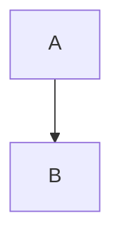
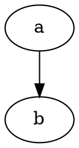

# Markdown 语法支持与兼容性

## 支持范围

- CommonMark：基础段落、标题、强调、列表、引用、链接、图片、代码块等
- GFM（GitHub Flavored Markdown）：表格、任务列表、删除线等
- 扩展语法（BetterWriter）：
  - 高亮：`==高亮文本==` → `<mark>`
  - 数学：行内 `$...$`、块级 `$$...$$`（KaTeX 渲染）
  - 图表：Mermaid（```mermaid）、Graphviz（```dot / ```graphviz）

## 用法示例

### 高亮（Mark）

```md
这是==高亮文本==测试
```

### 数学（KaTeX）

行内：

```md
能量方程 $E = mc^2$ 很常见
```

块级：

```md
$$
\int_0^1 x^2 dx = \frac{1}{3}
$$
```

### Mermaid

```md

```

### Graphviz

```md

```

## 限制与注意事项

- `==高亮==` 目前按“纯文本内联”规则解析，不支持跨段落/跨节点匹配；在代码/数学块内不会生效。
- 数学使用 KaTeX 渲染，兼容 KaTeX 支持的 LaTeX 子集；不支持少数 MathJax 专有指令。
- Mermaid 语法错误时默认静默处理（不在预览区域输出底层错误串），以避免编辑过程中的闪烁与干扰。
- 预览会对数学/图表块移除代码块外层容器样式（避免出现“黑框/背景块”），并对 Mermaid 渲染做轻量去抖以提升编辑稳定性。
- Graphviz 渲染依赖浏览器端按需加载 WASM，首次渲染可能稍慢；渲染结果以 SVG 图片方式嵌入，避免脚本执行风险。
- 本版本未内置 PDF/Word 导出；如需导出，建议复用与预览一致的渲染配置（见“升级指南”）。
